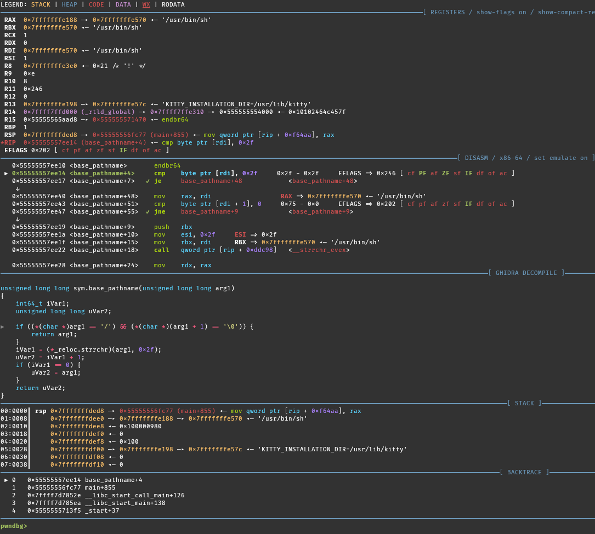

# Ghidra

Unlike with IDA and Binary Ninja, Ghidra is not considered an "integration provider". You cannot synchronise your Ghidra reverse engineering progress to Pwndbg.
You can however integrate Ghidra's decompiler into Pwndbg such that the decompiled version of any function you're in is shown in the Pwndbg context.

??? example "Example Screenshot"
    

To do this, we will need the help of [radare2](https://github.com/radareorg/radare2) or [rizin](https://github.com/rizinorg/rizin).

## Setup

=== "rizin"
    1. Install [rizin](https://github.com/rizinorg/rizin). It must be found by the debugger (within path).
    2. Install the Ghidra plugin for rizin: [rz-ghidra](https://github.com/rizinorg/rz-ghidra).
    3. Install [rzpipe](https://pypi.org/project/rzpipe/) and make sure the python used by the debugger can access it.
    4. Add `set r2decompiler rizin` to your `~/.gdbinit` after Pwndbg is sourced.

    Regarding the third step, if you don't install to your user or system-wide python (but rather a virtual environment), you may add something like this to the beginning of your `~/.gdbinit`:
    ```
    python
    import sys
    import os
    from glob import glob

    venv = os.path.expanduser('~/tools/rizin/venv')
    site_dir_pattern = os.path.join(venv, 'lib', 'python*/site-packages')
    site_dirs = glob(site_dir_pattern)
    sys.path.insert(0, site_dirs[0])
    import rzpipe
    end
    ```
=== "radare2"
    1. Install [radare2](https://github.com/radareorg/radare2). It must be found by the debugger (within path).
    2. Install the Ghidra plugin for radare2: [r2ghidra](https://github.com/radareorg/r2ghidra).
    3. Install [r2pipe](https://pypi.org/project/r2pipe/) and make sure the python used by the debugger can access it.
    4. Add `set r2decompiler radare2` to your `~/.gdbinit` after Pwndbg is sourced.

    Regarding the third step, if you don't install to your user or system-wide python (but rather a virtual environment), you may add something like this to the beginning of your `~/.gdbinit`:
    ```
    python
    import sys
    import os
    from glob import glob

    venv = os.path.expanduser('~/tools/radare2/venv')
    site_dir_pattern = os.path.join(venv, 'lib', 'python*/site-packages')
    site_dirs = glob(site_dir_pattern)
    sys.path.insert(0, site_dirs[0])
    import r2pipe
    end
    ```

## Usage

Append `set context-ghidra if-no-source` to your `~/.gdbinit`. You should be able to see the
`[ GHIDRA DECOMPILE ]` context now right below your disassembly. If you want to temporarily enable/disable
it or move around the context sections, see [context-ghidra](../../configuration/config.md#context-ghidra)
and [contextoutput](../../commands/context/contextoutput.md).

Be warned, the first call to both radare2/r2ghidra and rizin/rz-ghidra are rather slow!
Subsequent requests for decompiled source will be faster. And it does take up some resources
as the radare2/rizin instance is kept by r2pipe/rzpipe to enable faster subsequent analysis.

Remark: the plugin tries to guess the correct current line and mark it with "-->", but it might
get it wrong.
