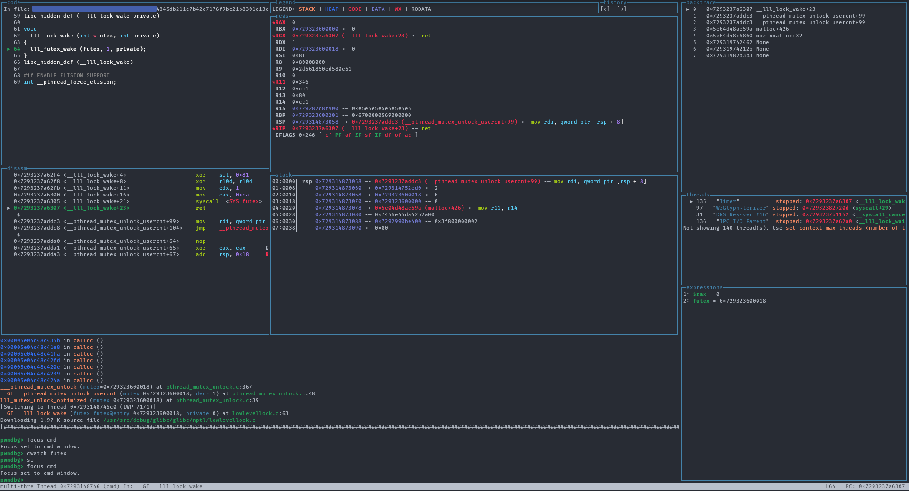

# GDB TUI



The context sections are available as native [GDB TUI](https://sourceware.org/gdb/current/onlinedocs/gdb.html/TUI.html) windows named `pwndbg_[sectionname]`. There are some predefined layouts coming with Pwndbg which you can select using `layout pwndbg` or `layout pwndbg_code`.

Use `focus cmd` to focus the command window and have the arrow keys scroll through the command history again. `tui disable` to disable TUI mode and go back to CLI mode when running commands with longer output. `ctrl-x + a` toggles between TUI and CLI mode quickly. Hold shift to ignore the TUI mouse integration and use the mouse normally to select text or copy data.

To create [your own layout](https://sourceware.org/gdb/current/onlinedocs/gdb.html/TUI-Commands.html) and selecting it use normal `tui new-layout` syntax like:
```
tui new-layout pwndbg_custom {-horizontal { { -horizontal { pwndbg_code 1 pwndbg_disasm 1 } 2 { {-horizontal pwndbg_legend 8 pwndbg_control 2 } 0 pwndbg_regs 1 pwndbg_stack 1 } 3 } 7 cmd 3 } 3 { pwndbg_backtrace 2 pwndbg_expressions 2 pwndbg_threads 1 } 1 } 1 status 1
layout pwndbg_custom
```
