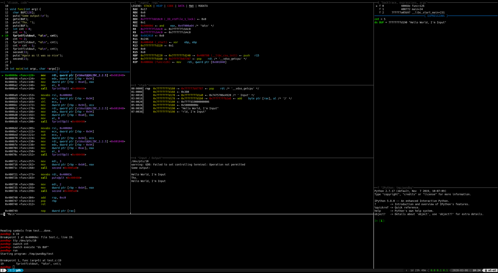

# Splitting / Layouting Context

i.e. doing this:


In Pwndbg, the context sections can be distributed among different tty by using the [`contextoutput`](../commands/context/contextoutput.md) command. Example:
```
contextoutput stack /path/to/tty true
```

If you use a terminal or multiplexer that supports scripted pane splitting, you can write a Python script that will create the panes and distribute them to your liking whenever you start Pwndbg.

For instance, for tmux, you could write something like this:
```python
python
import atexit
import os
from pwndbg.commands.context import contextoutput, output, clear_screen
bt = os.popen('tmux split-window -P -F "#{pane_id}:#{pane_tty}" -d "cat -"').read().strip().split(":")
st = os.popen(F'tmux split-window -h -t {bt[0]} -P -F '+'"#{pane_id}:#{pane_tty}" -d "cat -"').read().strip().split(":")
re = os.popen(F'tmux split-window -h -t {st[0]} -P -F '+'"#{pane_id}:#{pane_tty}" -d "cat -"').read().strip().split(":")
di = os.popen('tmux split-window -h -P -F "#{pane_id}:#{pane_tty}" -d "cat -"').read().strip().split(":")
panes = dict(backtrace=bt, stack=st, regs=re, disasm=di)
for sec, p in panes.items():
  contextoutput(sec, p[1], True)
contextoutput("legend", di[1], True)
atexit.register(lambda: [os.popen(F"tmux kill-pane -t {p[0]}").read() for p in panes.values()])
end
```
If you're using tmux specifically, you can use [pwnmux](https://github.com/joaogodinho/pwnmux) as a prebuilt layout or [splitmind](https://github.com/jerdna-regeiz/splitmind) to easily configure the layout you want.

!!! example

    The above example uses splitmind and following configuration:
    ```python
    python
    import splitmind
    (splitmind.Mind()
      .tell_splitter(show_titles=True)
      .tell_splitter(set_title="Main")
      .right(display="backtrace", size="25%")
      .above(of="main", display="disasm", size="80%", banner="top")
      .show("code", on="disasm", banner="none")
      .right(cmd='tty; tail -f /dev/null', size="65%", clearing=False)
      .tell_splitter(set_title='Input / Output')
      .above(display="stack", size="75%")
      .above(display="legend", size="25")
      .show("regs", on="legend")
      .below(of="backtrace", cmd="ipython", size="30%")
    ).build(nobanner=True)
    end
    ```

If you're using kitty, you may check out [kittydbg](https://github.com/k4lizen/kittydbg) for a prebuilt layout.
