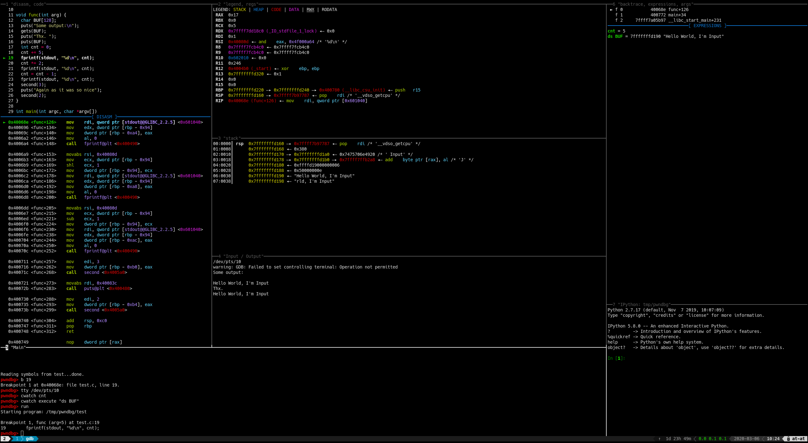

---
hide:
  - navigation
---

<!--
  This document should give an overview of some of the most interesting
  features Pwndbg has to offer. Use a lot of screenshots and recordings.
  Don't go too much in-depth - it is better to write a tutorial in another
  page of the docs and simply link to it.
-->

# Features

Pwndbg has a great deal of useful features. You can a see all available commands at any time by typing the `pwndbg` command or by checking the [Commands section](commands/index.md) of the documentation. For configuration and theming see the [Configuration section](configuration/index.md). Below is a subset of commands which are easy to capture in screenshots.

## Disassembly and Emulation

Pwndbg leverages the [capstone](https://github.com/capstone-engine/capstone) and [unicorn](https://github.com/unicorn-engine/unicorn) engines, along with its own instrospection, to display, annotate and emulate instructions.

Operands of instructions are resolved, conditions evaluated, and only the instructions that will actually be executed are shown.

This is incredibly useful when stepping through jump tables, PLT entries, and ROPping.

## Context

A useful summary of the current execution context is printed every time the debugger stops (e.g. breakpoint or single-step), displaying all registers, the stack, call frames, disassembly, and additionally recursively dereferencing all pointers.  All memory addresses are color-coded to the type of memory they represent.

A history of previous context output is kept which can be accessed using the `contextprev` and `contextnext` commands.

### Arguments

All function call sites are annotated with the arguments to those functions.  This works best with debugging symbols, but also works in the most common case where an imported function (e.g. libc function via GOT or PLT) is used.

### Splitting / Layouting Context

The context sections can be distributed among different tty by using the `contextoutput` command. Thus, if you want to make better use of some of the empty space in the default Pwndbg output, you can split the panes in your terminal and redirect the various contexts among them.

See [Splitting the Context](tutorials/splitting-the-context.md) for more information.

### GDB TUI
The context sections are available as native [GDB TUI](https://sourceware.org/gdb/current/onlinedocs/gdb.html/TUI.html) windows named `pwndbg_[sectionname]`. There are some predefined layouts coming with Pwndbg which you can select using `layout pwndbg` or `layout pwndbg_code`.

See [GDB TUI](tutorials/gdb-tui.md) for more information.

### Watch Expressions

You can add expressions to be watched by the context. Those expressions are evaluated and shown on every context refresh. For instance by doing `contextwatch execute "info args"` we can see the arguments of every function we are in (here we are in `mmap`):

See [`contextwatch`](commands/context/contextwatch.md) for more information.

## Integrations

### Ghidra

With the help of [radare2](https://github.com/radareorg/radare2) or [rizin](https://github.com/rizinorg/rizin) it is possible to show the decompiled source code of the ghidra decompiler.

See [Ghidra Integration](tutorials/decompiler-integration/ghidra-integration.md) for more information.

### IDA Pro/Binary Ninja

Pwndbg is capable of integrating with IDA Pro or Binary Ninja by installing an XMLRPC server in the decompiler as a plugin, and then querying it for information.

This allows extraction of comments, decompiled lines of source, breakpoints, symbols, and synchronized debugging (single-steps update the cursor in the decompiler).

{ style="width: 70%;" }

See [Binary Ninja Integration](tutorials/decompiler-integration/binja-integration.md) or [IDA Integration](tutorials/decompiler-integration/ida-integration.md) for setup information.

## Heap Inspection

Pwndbg provides commands for inspecting the heap and the allocator's state. Currently supported are:

+ [glibc malloc](commands/index.md#glibc-ptmalloc2-heap)
+ [jemalloc](commands/index.md#jemalloc-heap)
+ [linux's buddy allocator](commands/kernel/buddydump.md)
+ [linux's SLUB allocator](commands/kernel/slab.md)

See *some* of the commands for glibc malloc:
{ style="width: 70%;" }
{ style="width: 70%;" }

{ style="width: 70%;" }

## LLDB

While most other GDB plugins are well *GDB plugins*, Pwndbg's implementation is debugger-agnostic. You can use Pwndbg with LLDB!

{ style="width: 70%;" }

## WinDbg Compatibility

For those coming from a Windows background, Pwndbg has a complete WinDbg compatibility layer.  You can `dd`, `dps`, `eq`, and even `eb $rip 90` to your heart's content.

{ style="width: 70%;" }

## Go Debugging

Pwndbg has support for dumping complex Go values like maps and slices, including automatically parsing out type layouts in certain cases.

See the [Go debugging guide](tutorials/go-debugging.md) for more information.

## So many commands

Go take a look at [Commands](commands/index.md)! Here is some cool stuff you can do to get you started.

### Process State Inspection

Use the [`procinfo`](commands/process/procinfo.md) command in order to inspect the current process state, like UID, GID, Groups, SELinux context, and open file descriptors! Pwndbg works particularly well with remote GDB debugging like with Android phones.

{ style="width: 50%;" }
{ style="width: 50%;" }

### ROP Gadgets

Tools for finding rop gadgets statically don't know about everything that will be loaded into the address space and they can make mistakes about which addresses will actually end up executable. You can now rop at runtime with Pwndbg's [`rop`](commands/integrations/rop.md) and [`ropper`](commands/integrations/ropper.md).

{ style="width: 70%;" }

### Search

Pwndbg makes [`search`](commands/memory/search.md)ing the target memory space easy, with a complete and easy-to-use interface.  Whether you're searching for bytes, strings, or various sizes of integer values or pointers, it's a simple command away.

### Finding Leaks
Finding leak chains can be done using the [`leakfind`](commands/memory/leakfind.md) and [`probeleak`](commands/memory/probeleak.md) commands. They recursively inspect address ranges for pointers, and report on all pointers found.

### Telescope
Inspecting memory dumps is easy with the [`telescope`](commands/memory/telescope.md) command.  It recursively dereferences a range of memory, letting you see everything at once.  As an added bonus, Pwndbg checks all of the available registers to see if they point into the memory range.

{ style="width: 70%;" }

### Virtual Memory Maps
Pwndbg enhances the standard memory map listing and allows easy searching with [`vmmap`](commands/memory/vmmap.md).

{ style="width: 70%;" }
{ style="width: 70%;" }

### Tracking glibc heap allocations
It can be very useful to see allocations happening in real time. It can give us a good idea of what the allocation pattern of a program looks like, and allows us to make informed decisions on how to optimize or attack it. The [`track-heap`](commands/linux_libc_elf/track-heap.md) command does just that.

<video style="width: 80%;" autoplay loop muted playsinline alt="track-heap example">
  <source src="../assets/videos/track-heap.webm" type="video/webm">
  <source src="../assets/videos/track-heap.mp4" type="video/mp4">
</video>

### Tracking the GOT
The Procedure Linkage Table (PLT) and Global Offset Table (GOT) are very interesting exploitation targets since they contain many often-accessed function pointers. You can track how your program goes through the GOT using the [`track-got`](commands/linux_libc_elf/track-got.md) command.

<video autoplay loop muted playsinline alt="track-got example">
  <source src="../assets/videos/track-got.webm" type="video/webm">
  <source src="../assets/videos/track-got.mp4" type="video/mp4">
</video>

### Attach to a process by name
The days of running pidof in a different terminal are over. Use [`attachp`](commands/start/attachp.md) to attach to any process by name, pid, arguments or device file!

{ style="width: 70%;" }
